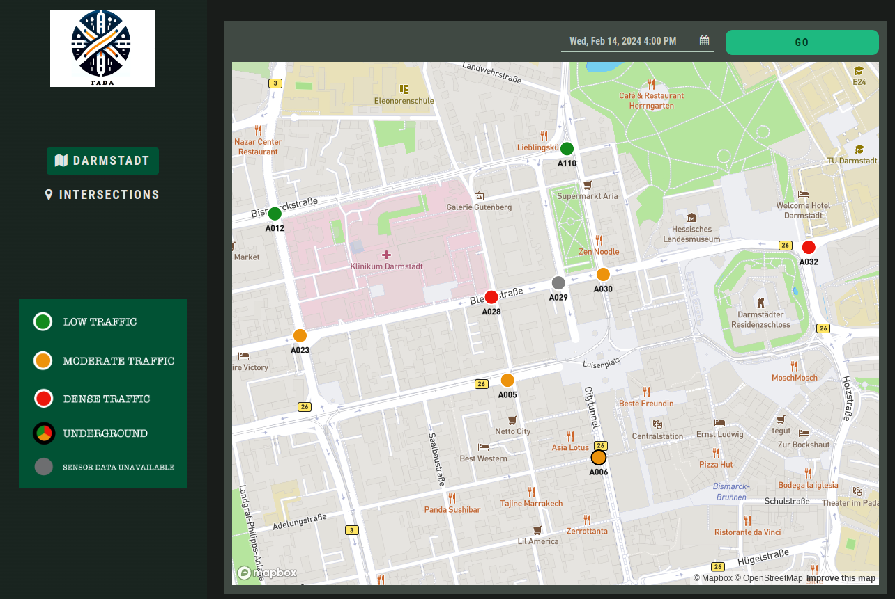

## Data Science Project by Data Dorks
### Darmstadt Traffic analysis - TADA: Traffic Agent DArmstadt

The objective of this seminar project is to first analyze Darmstadt road traffic data and then study the effectiveness of various machine learning models for the analysis and forecasting of traffic data. Subsequently, the most suitable model for the use-case is determined and a prototype application is developed. The web application predicts the traffic conditions for a particular road intersection by training with the traffic data in a timeseries format.

The EDA and forecasting is performed using Python. The dataset can be found at:

- [Darmstadt Dataset](https://datenplattform.darmstadt.de/verkehr/apps/opendata/#/])

### Task management

A Trello board is used for documentation purposes of tasks.
- [Tasks](https://trello.com/b/OATB7Niv/traffic-data-analysis)

#### Weekly Meeting

Weekly team meeting every Thursday evening at 19:00.
[Meeting Link](https://meet.google.com/vcu-hhob-dfz)

### Introduction

- Time-series Data is used and can be found at : [Datenplattform Darmstadt](https://datenplattform.darmstadt.de/verkehr/apps/opendata/#/])
- The data is taken for a period of 2 years from May 2021 to May 2023.
- Data is recorded every minute.

### Using the TADA-Application

- Two approaches are possible, to run via Anvil online account, please follow below mentioned steps. To run locally, please refer [README](./Frontend/README.md)
- Create an [Anvil](https://anvil.works) account  and upload the [TADA.yaml](./TADA.yaml) file to the Anvil account (more detailed instructions on how to upload in Frontend [README](./Frontend/README.md))
- Copy the personal server uplink key from the Anvil account
- Run the first block of [Backend_and_Server.ipynb](./Backend_and_Server.ipynb) to run predictions using RandomForest model
- Update the second block with the personal server uplink key (obtained from Anvil account)
- Now run the second block of code that connects with the Anvil server
- Run the Anvil app from Anvil interface/local clone (based on whether running locally or not - detailed instructions in frontend Folder to run locally).

The app is now ready to be used.
- In the ``Darmstadt`` overview, select a date and time and the past/ predicted traffic situation at 9 junctions will be shown
- In the ``Intersections`` tab, two junctions and a date and time can be selected. By clicking ``GO``, the determined traffic load between them is visualized.

### Folder Overview

#### 1. Main

Contains the app as yaml file and the backend and server code necessary to run the project.
Requirements for running the project can be found in [requirements](requirements.txt)

#### 2. Dataset

Contains all preprocessed datasets (9 Junctions in Darmstadt), ready to be loaded into the backend code.

#### 3. Preprocessing

Contains more information on the raw dataset and the code used for preprocessing the raw dataset, in order to make it suitable for the model.
Also contains the code that was used to perform the Exploratory Data Analysis, that led to the understanding of the undelying trends in the data.

> **Exploratory Data Analysis**
>
> Initially, a trend analysis is done for the overall number of datapoints and the number of records each day. Plots reflecting the annual change in number of cars and the time-based change in number of cars are obtained. The dataset is found to have a seasonality element. Seasonality based on days of the week, time of the day and months of the year are further explored and plotted. Furthermore, the average number of cars every month are plotted for every year and the prescence of any seasonal components are noted.
> Code can be found in [EDA_Exploratory_Data_Analysis.ipynb](./Preprocessing/EDA_Exploratory_Data_Analysis.ipynb).
>
> **Data Preprocessing**
>
A small amount of pre-processing had to be done for the EDA, which included
> - identifying all null columns and removing them
> - removing time-interval [ms] columns
>
In the [data_pre_processing](./Preprocessing/data_pre_processing.ipynb) file, data cleaning and segmentation to columns is done with a focus on making the dataset a suitable input to the model.
> - an hourly sum of the dataset was acquired based on datetime column
> - the date-time column was split into ``Date`` and ``Time`` columns, and then further split into ``year``, ``month``,``day`` and ``hour``
> - all unnecessary columns were dropped and the pre-processed dataset was saved, and can be found in dataset Folder

#### 4. Model

Contains the files used to evaluate various models considered for modelling the dataset and code used to try to tune hyperparameters of chosen model.
Various models were considered for this project after research and the viability of some of these models were tested to find the model most fitting to the dataset.
This folder contains the codes used to load and test various models with our pre-processed dataset and compare the metrics.

> **Random Forest**
>
> - The Random Forest model was found to be the best fit for our datasets, and it was further explored whether hyper-parameter tuning could be done to make the model performance better.
> - The code used for hyperparameter tuning had to be modified in order to take into consideration the incompatability of the time-series model with the inbuilt random forest cross-validation feature present in the sci-kit hyperparameter tuning.

#### 5. Frontend

Contains the final application file in both the yaml format (Recommended : used for Anvil app) and the TADA folder (used to run app locally) and the server code necessary to run the application locally.
Instructions on running app locally can be found in the [README](./Frontend/README.md) file of this folder.

The datasets must be downloaded from dataset branch and the path to the datasets must be checked in the python code before implementation. [server_code](./Frontend/server_code.py) file can be used to run app locally.

> **Running the Application**
> - see the [Frontend-README](./Frontend/README.md) for key development details of the frontend and further instructions
> - The [TADA.yaml](TADA.yaml) file must be uploaded in Anvil account.
> - The [Backend_and_Server](Backend_and_Server.ipynb) (present in main) file must be run locally, after updating with personal server uplink key (obtained from Anvil account), to connect to the server.
> - App can now be run from Anvil using the ``RUN`` button.

#### 6. Documents

Contains the final presentation slides (in both pptx format and as pdf) and the Data Science Canvas.
